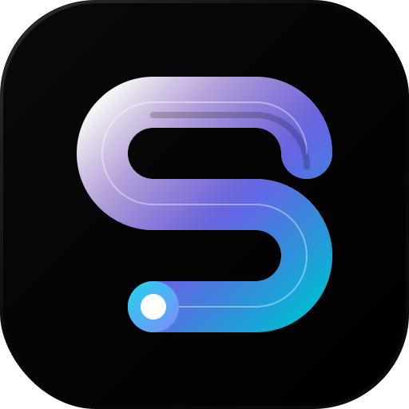
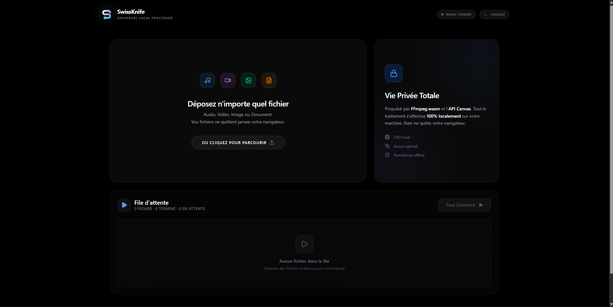

<div align="center">



# 🔧 SwissKnife

**A universal file converter that runs entirely in your browser.**

Convert video, audio, and image files instantly — no upload, no server, no limits.

[](https://react.dev)
[](https://www.typescriptlang.org)
[](https://vite.dev)
[](https://ffmpegwasm.netlify.app)
[](https://www.docker.com)
[](LICENSE)

<br/>

<!-- Remplace "screenshot.png" par le vrai nom de ton image si besoin -->


</div>

---

## ✨ Features

- **🔒 100% Private** — All conversions happen locally in your browser via WebAssembly. No file ever leaves your device.
- **🎬 Video Conversion** — MP4, MKV, WEBM, AVI, MOV, GIF
- **🎵 Audio Conversion** — MP3, WAV, AAC, OGG, FLAC
- **🖼️ Image Conversion** — JPG, PNG, WEBP, TIFF, BMP
- **📦 Batch Processing** — Drag & drop multiple files, convert them all at once
- **🎨 Modern UI** — Bento Grid layout with smooth animations (Motion), dark theme, fully responsive
- **🛠️ Debug Console** — Built-in FFmpeg log viewer for troubleshooting
- **🚀 Instant Start** — FFmpeg engine is lazy-loaded only when needed

---

## 🖥️ Supported Formats

| Category | Input / Output Formats |
|----------|----------------------|
| **Video** | `MP4` · `MKV` · `WEBM` · `AVI` · `MOV` · `GIF` |
| **Audio** | `MP3` · `WAV` · `AAC` · `OGG` · `FLAC` |
| **Image** | `JPG` · `PNG` · `WEBP` · `TIFF` · `BMP` |

> Images are converted using the native **Canvas API** for maximum speed.  
> Video and audio files are processed through **FFmpeg WASM** (single-threaded, compatible with all devices).

---

## 🚀 Getting Started

### Prerequisites

- [Node.js](https://nodejs.org) (v18+)

### Local Development
```bash
# Clone the repository
git clone [https://github.com/lucas-lepajollec/SwissKnife.git](https://github.com/lucas-lepajollec/SwissKnife.git)
cd SwissKnife

# Install dependencies
npm install

# Start the development server
npm run dev
```

The app will be available at **http://localhost:2499**.

---

## 🐳 Docker Deployment

A pre-built image is published on **GitHub Container Registry** — no need to clone the repo or build anything.

**1. Create a `docker-compose.yml` file:**
```yaml
services:
  swissknife:
    image: ghcr.io/lucas-lepajollec/swissknife:latest
    container_name: swissknife
    ports:
      - "2501:80"
    restart: unless-stopped
```

**2. Start the container:**

```bash
docker compose up -d
```

The app will be available at **http://localhost:2501**.

---

## 🏗️ Tech Stack

| Layer | Technology |
|-------|-----------|
| **Framework** | React 19 + TypeScript |
| **Bundler** | Vite 6 |
| **Styling** | Tailwind CSS 4 |
| **Animations** | Motion (Framer Motion) |
| **Conversion Engine** | FFmpeg WASM 0.12 + Canvas API |
| **Icons** | Lucide React |
| **Deployment** | Docker + Nginx |

---

## 📂 Project Structure
```text
SwissKnife/
├── src/
│   ├── components/       # UI components
│   │   ├── Header.tsx        # Top navigation bar
│   │   ├── Dropzone.tsx      # Drag & drop file input
│   │   ├── FileQueue.tsx     # Conversion queue & controls
│   │   ├── PrivacyCard.tsx   # Privacy information card
│   │   └── DebugConsole.tsx  # FFmpeg log viewer
│   ├── hooks/
│   │   └── useFFmpeg.ts      # FFmpeg WASM lifecycle & conversion logic
│   ├── lib/
│   │   ├── formats.ts        # Format detection, mapping & FFmpeg args
│   │   ├── imageConverter.ts # Canvas-based image conversion
│   │   └── utils.ts          # Shared utilities
│   ├── App.tsx               # Root application component
│   └── main.tsx              # Entry point
├── Dockerfile                # Multi-stage production build
├── docker-compose.yml        # Docker Compose config
├── nginx.conf                # Nginx serving config
└── package.json
```

---

## 📜 Available Scripts

| Command | Description |
|---------|-------------|
| `npm run dev` | Start development server (port 2499) |
| `npm run build` | Build for production |
| `npm run preview` | Preview production build |
| `npm run lint` | Type-check with TypeScript |
| `npm run clean` | Remove `dist/` folder |

---

## 🤝 Contributing

Contributions are what make the open source community such an amazing place to learn, inspire, and create. Any contributions you make are **greatly appreciated**.

Please read our [Contributing Guidelines](CONTRIBUTING.md) to learn how to setup your environment, and our [Code of Conduct](CODE_OF_CONDUCT.md) for details on our community standards.

---

<div align="center">

Made with ❤️ using React, FFmpeg WASM & Vite

</div>