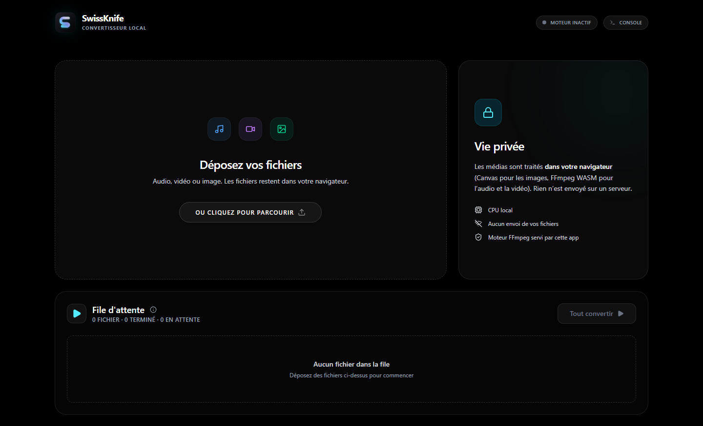

<div align="center">


# SwissKnife

**Convertisseur de fichiers local : audio, vidéo et images, dans le navigateur.**

Aucun envoi de vos médias. Pas de compte. Pas de serveur de conversion.

[](https://react.dev)
[](https://www.typescriptlang.org)
[](https://vite.dev)
[](https://ffmpegwasm.netlify.app)
[](https://www.docker.com)
[](LICENSE)

<br/>



</div>

---

## Ce que l’app fait vraiment

- **Médias utilisateur** — restent dans l’onglet (`File` + `blob:`). Pas d’upload.
- **Images** — API Canvas. Sorties : JPG, PNG, WEBP. Plusieurs images peuvent être converties **en même temps**.
- **Audio / vidéo** — FFmpeg WASM (un thread). Le core est servi **par cette application** (`/ffmpeg/`) ; il n’est plus téléchargé depuis unpkg. Une seule conversion FFmpeg à la fois (file d’attente) ; vous pouvez quand même lancer plusieurs fichiers, ils s’enchaînent.
- **GIF** — traité comme une vidéo (FFmpeg), pas comme une image Canvas.
- **TIFF / BMP** — lus en entrée seulement si le navigateur les décode. **Pas proposés en sortie** (Canvas ne les encode pas de façon fiable).
- **Autres types** (PDF, texte, etc.) — refusés, pas mis en file.
- **Limite pratique** — pas de plafond artificiel, mais au-delà de **50 Mo** un avertissement s’affiche : la mémoire de l’onglet peut saturer.

Le moteur FFmpeg est téléchargé depuis **cette origine** au premier fichier audio/vidéo. Après ça, plus besoin du réseau pour convertir. Une conversion d’images seules ne charge pas FFmpeg.

Voir aussi [NOTICE.md](NOTICE.md) (licences FFmpeg / x264).

---

## Formats

| Catégorie | Entrées reconnues | Sorties |
|----------|-------------------|---------|
| **Vidéo** | MP4, MKV, WEBM, AVI, MOV, GIF | MP4, MKV, WEBM, AVI, MOV, GIF |
| **Audio** | MP3, WAV, AAC, OGG, FLAC, M4A (entrée) | MP3, WAV, AAC, OGG, FLAC |
| **Image** | JPG, PNG, WEBP ; BMP/TIFF si le navigateur les lit | JPG, PNG, WEBP |

Les codecs réellement disponibles sont ceux du core `@ffmpeg/core@0.12.6` (dont libx264 / libmp3lame dans la pratique actuelle). Un fichier peut quand même échouer selon le contenu.

---

## Démarrage

**Node.js 20+**

```bash
git clone https://github.com/lucas-lepajollec/SwissKnife.git
cd SwissKnife
npm install
npm run dev
```

Interface : **http://localhost:2499**

Le serveur reste lié à `127.0.0.1` par défaut. Pour tester SwissKnife depuis un
autre appareil du réseau local, utilisez `npm run dev:lan`.

---

## Docker

Image publique : `ghcr.io/lucas-lepajollec/swissknife:latest`

Le conteneur écoute sur le port **8080** (utilisateur non-root). Exposez-le en 2501 sur l’hôte.

```yaml
services:
  swissknife:
    image: ghcr.io/lucas-lepajollec/swissknife:latest
    container_name: swissknife
    ports:
      - "2501:8080"
    restart: unless-stopped
```

```bash
docker compose up -d
```

→ **http://localhost:2501**

Le fichier `docker-compose.yml` du dépôt est déjà ce modèle. Pour construire depuis les sources :

```bash
docker compose -f docker-compose.build.yml up -d --build
```

Les tags d’image poussés par la CI : `latest` sur `main`, plus le tag Git (`v1.0.0`, etc.).

---

## Démo publique

Même application, même dépôt. Fichiers toujours locaux dans le navigateur.

Le déploiement Vercel (noindex, headers WASM) est décrit dans [DEMO.md](DEMO.md). Ne pas annoncer l’URL publique tant qu’elle ne répond pas en HTTPS `200`.

---

## Stack

| Couche | Choix |
|--------|--------|
| UI | React 19 + TypeScript (strict) |
| Build | Vite 6 |
| Style | Tailwind CSS 4 |
| Images | Canvas API |
| Audio / vidéo | FFmpeg WASM 0.12, core local |
| Prod | Docker + Nginx unprivileged |

---

## Scripts

| Commande | Rôle |
|----------|------|
| `npm run dev` | Dev, port 2499 |
| `npm run dev:lan` | Dev accessible sur le réseau local, port 2499 |
| `npm test` | Vitest |
| `npm run lint` | `tsc --noEmit` + ESLint |
| `npm run build` | Build + copie du core FFmpeg dans `dist/ffmpeg/` |
| `npm run build:demo` | Build Vercel (`VITE_DEMO=true`, noindex) |
| `npm run preview` | Preview, mêmes headers WASM que le dev |
| `npm run clean` | Supprime `dist/` |

---

## Structure

```text
SwissKnife/
├── src/
│   ├── components/
│   ├── hooks/useFFmpeg.ts
│   ├── lib/
│   │   ├── formats.ts
│   │   ├── imageConverter.ts
│   │   └── ffmpegEngine.ts
│   ├── App.tsx
│   └── main.tsx
├── Dockerfile
├── docker-compose.yml          # image GHCR
├── docker-compose.build.yml    # build local
├── nginx.conf
├── vercel.json                 # démo publique
├── DEMO.md
└── package.json
```

---

## Licence

MIT pour le code SwissKnife. Le moteur FFmpeg WASM a ses propres obligations — [NOTICE.md](NOTICE.md).

Contributions : [CONTRIBUTING.md](CONTRIBUTING.md). Conduite : [CODE_OF_CONDUCT.md](CODE_OF_CONDUCT.md).
