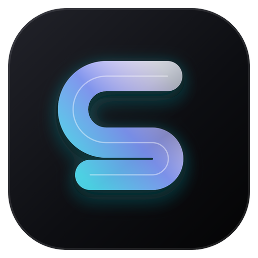
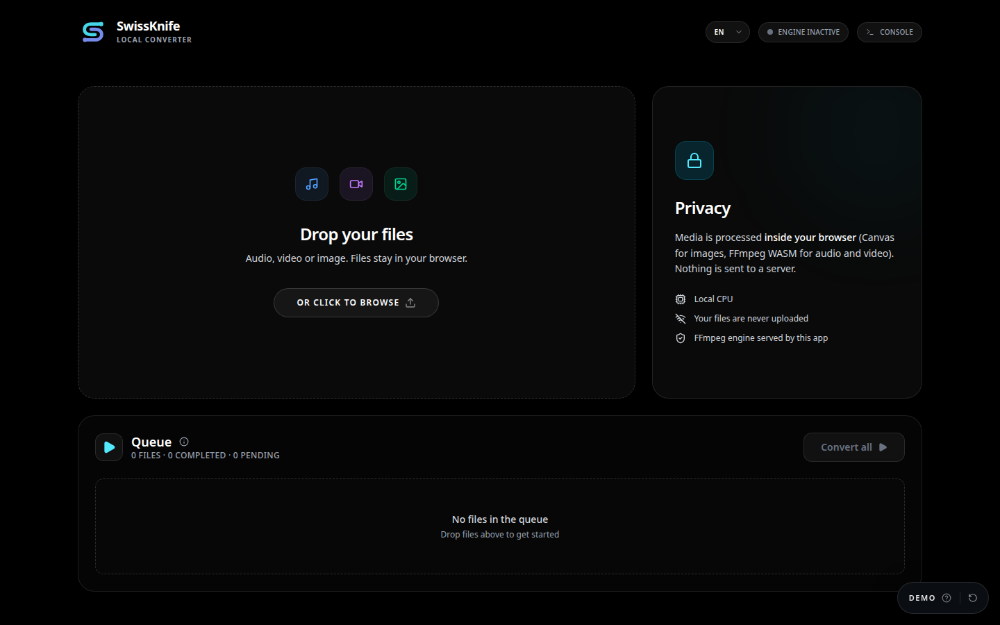

<div align="center">
  
  <h1>SwissKnife</h1>
  <p><strong>Local-first image, audio, and video conversion—directly in your browser.</strong></p>
  <p>Your files stay in the tab. No account. No conversion server.</p>

  <p>
    <a href="https://swissknife.lucas-homelab.fr"><strong>Website</strong></a> ·
    <a href="https://demo.swissknife.lucas-homelab.fr"><strong>Live demo</strong></a> ·
    <a href="https://docs.swissknife.lucas-homelab.fr"><strong>Documentation</strong></a>
  </p>

  <p>
    <a href="LICENSE"></a>
    
    
  </p>

  
</div>

## Overview

SwissKnife converts common media formats without sending source files to a third-party conversion service. Images use browser-native Canvas APIs; audio and video use a single-threaded FFmpeg WebAssembly engine served with the application.

That boundary is the product: media is represented by browser `File` and `blob:` objects, conversion happens in the current tab, and the result is downloaded by the user.

## Product preview


The interface keeps the processing boundary visible: file intake, format selection, queue state, conversion progress, logs, and downloads stay in one local workspace.

## Highlights

- Converts multiple images concurrently with the Canvas API.
- Queues audio and video conversions through one FFmpeg WASM worker.
- Serves the FFmpeg core from the same application origin instead of a public CDN.
- Loads FFmpeg only when an audio or video file requires it.
- Rejects unsupported document and arbitrary file types before they enter the queue.
- Shows a practical memory warning above 50 MB.
- Runs as a static application or an unprivileged Nginx container.

## Quick start

### Docker Compose

Create `docker-compose.yml`:

```yaml
services:
  swissknife:
    image: ghcr.io/lucas-lepajollec/swissknife:latest
    container_name: swissknife
    ports:
      - "2501:8080"
    restart: unless-stopped
    healthcheck:
      test: ["CMD", "wget", "-qO-", "http://127.0.0.1:8080/"]
      interval: 30s
      timeout: 5s
      retries: 3
      start_period: 10s
```

```bash
docker compose up -d
```

Open `http://localhost:2501`. To build the current checkout instead, use:

```bash
git clone https://github.com/lucas-lepajollec/SwissKnife.git
cd SwissKnife
docker compose -f docker-compose.build.yml up -d --build
```

### Local development

Requirements: Node.js 20 or newer and a modern browser with WebAssembly support.

```bash
git clone https://github.com/lucas-lepajollec/SwissKnife.git
cd SwissKnife
npm ci
npm run dev
```

Open `http://127.0.0.1:2499`. Use `npm run dev:lan` only when deliberately testing on a trusted network.

## Configuration and persistence

SwissKnife has no application database, user account, upload directory, or required runtime secret. Selected files and generated outputs exist only in browser memory until downloaded or the tab is closed.

The FFmpeg core is bundled into the deployed application under `/ffmpeg/` and is loaded on demand. Image-only conversion does not initialize FFmpeg.

## Security, privacy, and limitations

| Category | Recognized input | Output |
| --- | --- | --- |
| Video | MP4, MKV, WEBM, AVI, MOV, GIF | MP4, MKV, WEBM, AVI, MOV, GIF |
| Audio | MP3, WAV, AAC, OGG, FLAC, M4A | MP3, WAV, AAC, OGG, FLAC |
| Image | JPG, PNG, WEBP; BMP/TIFF when the browser can decode them | JPG, PNG, WEBP |

- GIF is handled by FFmpeg as video.
- BMP and TIFF support depends on browser decoding; Canvas cannot encode them reliably as output.
- The browser holds input and output data in memory, so large files can exhaust the tab.
- Conversion speed and codec support depend on the device, browser, and bundled FFmpeg build.
- A listed container can still fail when its internal codec or media structure is unsupported.
- User media is never uploaded by SwissKnife.

See [NOTICE.md](NOTICE.md) for FFmpeg, x264, and other third-party licensing information.

## Architecture

| Layer | Technology |
| --- | --- |
| Interface | React 19, TypeScript, Tailwind CSS 4 |
| Image conversion | Canvas API |
| Audio/video conversion | FFmpeg WASM 0.12, same-origin core |
| Tooling | Vite 6, Vitest, ESLint, TypeScript |
| Deployment | Static build, Docker, and unprivileged Nginx |

```text
src/components/           # Interface and queue views
src/hooks/useFFmpeg.ts    # Worker lifecycle
src/lib/formats.ts        # Accepted format contracts
src/lib/imageConverter.ts # Canvas pipeline
src/lib/ffmpegEngine.ts   # FFmpeg queue and commands
```

## Development and quality

| Command | Purpose |
| --- | --- |
| `npm run lint` | Run TypeScript and ESLint checks. |
| `npm test` | Run the Vitest suite. |
| `npm run build` | Build the app and copy the FFmpeg core into `dist/ffmpeg/`. |
| `npm run build:demo` | Build the isolated public-demo variant. |
| `npm run preview` | Preview with the headers required by FFmpeg WASM. |

## Public demo

The [public demo](https://demo.swissknife.lucas-homelab.fr) is built from the same browser-only application. It displays an explicit demo marker, retains local processing, and applies the cross-origin isolation headers required by FFmpeg WASM. See [DEMO.md](DEMO.md).

## Documentation and community

- [Documentation](https://docs.swissknife.lucas-homelab.fr)
- [Contributing guide](CONTRIBUTING.md)
- [Changelog](CHANGELOG.md)
- [Code of Conduct](CODE_OF_CONDUCT.md)
- [Security policy](SECURITY.md)
- [MIT License](LICENSE)
- [Third-party notices](NOTICE.md)
